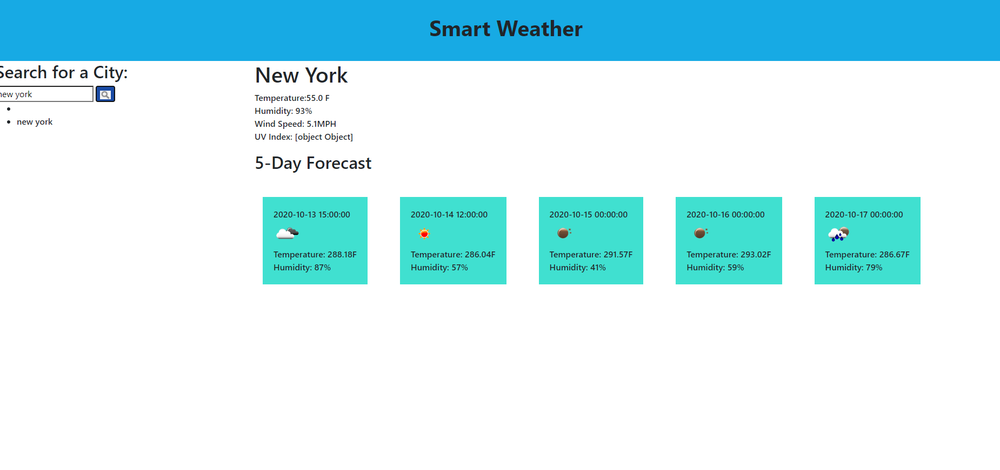

# smart-weather-app
This application features weather information for different cities. It supports search by cities and also stores the searches to local storage and displays previous searches as search history. The application's html and CSS  will be dynamically updated based on search city and will display information such as date and time, current and future weather conditions for the searched city, temperature, humidity, wind speed and  UV index. When a city in search history is clicked, it displays current and future weather forecast

# Technologies Used
### HTML
### CSS
### Open Weather API
### Ajax
### jQuery

# Live Link to App
 [ Live Site](https://terd47.github.io/smart-weather-app/).

[Github Repository](https://github.com/Terd47/smart-weather-app)

